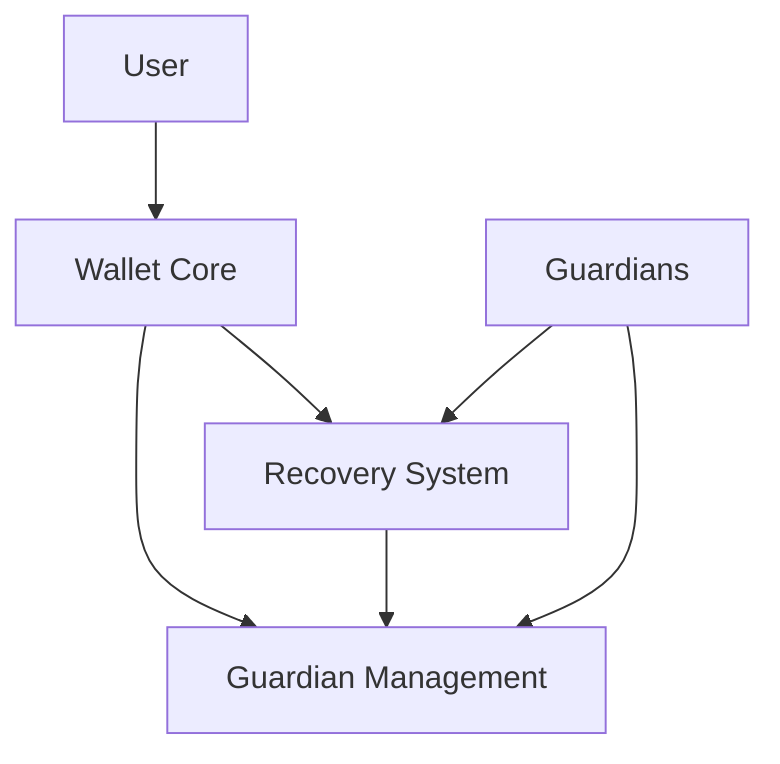

# Stack-based Bitcoin Wallet Architecture

## System Components

### 1. Core Wallet (wallet-core.clar)
- Main wallet functionality
- Balance management
- Transaction handling
- Owner management
- Interface with Bitcoin transactions

### 2. Recovery System (wallet-recovery.clar)
- Social recovery protocol
- Recovery request management
- Confirmation tracking
- Timelock mechanisms
- Recovery execution logic

### 3. Guardian Management (wallet-guardian.clar)
- Guardian registration
- Guardian permissions
- Voting system
- Guardian replacement mechanism

## Contract Interactions



## Data Structures

1. Wallet State
```clarity
{
    owner: principal,
    balance: uint,
    status: (string-ascii 12),
    last-active: uint
}
```

2. Guardian Registry
```clarity
{
    address: principal,
    added-height: uint,
    permissions: (list 8 bool)
}
```

3. Recovery Request
```clarity
{
    initiator: principal,
    timestamp: uint,
    confirmations: (list 10 principal),
    status: (string-ascii 12)
}
```

## Security Model

### Access Control
- Owner-only functions
- Guardian-only functions
- Public functions
- Multi-signature requirements

### Recovery Process
1. Initiation Phase
2. Confirmation Phase
3. Execution Phase
4. Completion Phase

### Timelock Mechanisms
- Recovery delay period
- Confirmation window
- Execution timelock

## Error Handling

Error codes and their meanings:
- ERR_UNAUTHORIZED (u1)
- ERR_INVALID_STATE (u2)
- ERR_INSUFFICIENT_CONFIRMATIONS (u3)
- ERR_TIMELOCK_ACTIVE (u4)
- ERR_INVALID_GUARDIAN (u5)
